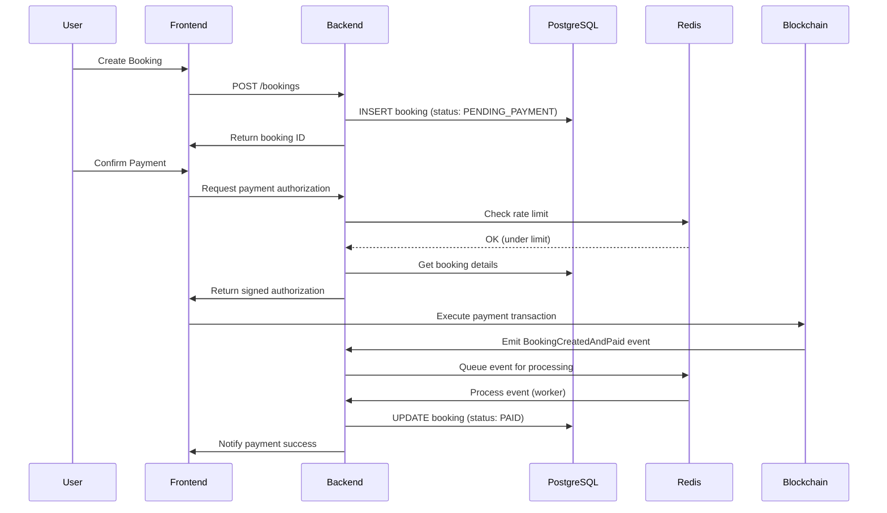

# 📚 Blockchain Integration with Existing Infrastructure
## How PostgreSQL (Supabase) and Redis (Railway) Support Smart Contract Integration

---

## 🎯 Overview

Since BookMe already uses **Supabase** (PostgreSQL) and **Railway** (with Redis addon), the blockchain integration leverages these existing services without requiring new infrastructure. Here's how each component serves a specific purpose in the blockchain integration.

---

## 🗄️ PostgreSQL (via Supabase) - The Source of Truth

### Why We Need It
PostgreSQL remains the **primary database** for all application data. The blockchain stores only **payment-critical information** (escrow amounts, payment status), while PostgreSQL stores the complete booking context.

### Blockchain-Specific Extensions
These are just **additional columns** added to existing tables, not new database technology:

```sql
-- These columns are added to your EXISTING Supabase bookings table
ALTER TABLE bookings ADD COLUMN blockchain_booking_id VARCHAR(66);  -- Links to smart contract
ALTER TABLE bookings ADD COLUMN blockchain_tx_hash VARCHAR(66);      -- Transaction proof
ALTER TABLE bookings ADD COLUMN blockchain_confirmed_at TIMESTAMP;   -- Confirmation time
ALTER TABLE bookings ADD COLUMN blockchain_data JSONB;              -- Event details
```

### Key Responsibilities
1. **Complete Booking Data**: Service details, customer preferences, scheduling
2. **User Profiles**: KYC data, preferences, history (not on blockchain for privacy)
3. **Blockchain Mapping**: Links database records to blockchain transactions
4. **Business Logic**: Complex queries, reporting, analytics (inefficient on blockchain)

### Real-World Example
```typescript
// When a booking is created
const booking = await supabase
  .from('bookings')
  .insert({
    service_id: 'abc123',
    customer_id: 'user456',
    scheduled_at: '2024-09-10 14:00',
    amount: 100.00,
    status: 'PENDING_PAYMENT',
    // Blockchain fields initially null
    blockchain_booking_id: null,
    blockchain_tx_hash: null
  });

// After blockchain payment
await supabase
  .from('bookings')
  .update({
    status: 'PAID',
    blockchain_booking_id: '0x7f8e9...',  // Links to smart contract
    blockchain_tx_hash: '0xabc123...',    // Proof of payment
    blockchain_confirmed_at: new Date()
  })
  .eq('id', booking.id);
```

---

## 🚀 Redis (via Railway Addon) - Event Processing Queue

### Why We Need It
Blockchain events are **asynchronous** and can arrive out of order. Redis provides a **reliable queue** to process these events sequentially without losing any.

### Key Use Cases

#### 1. Event Processing Queue
```typescript
// When blockchain event arrives (potentially out of order)
await redis.lpush('blockchain-events', JSON.stringify({
  type: 'BookingCreatedAndPaid',
  bookingId: '0x123...',
  transactionHash: '0xabc...',
  timestamp: Date.now()
}));

// Worker processes events in order
const event = await redis.rpop('blockchain-events');
await processBlockchainEvent(JSON.parse(event));
```

#### 2. Duplicate Prevention
```typescript
// Prevent processing same event twice (blockchain can emit duplicates)
const eventKey = `processed:${transactionHash}-${logIndex}`;
const alreadyProcessed = await redis.get(eventKey);

if (!alreadyProcessed) {
  await processEvent(event);
  await redis.setex(eventKey, 86400, '1'); // Cache for 24 hours
}
```

#### 3. Rate Limiting
```typescript
// Prevent signature generation abuse
const userKey = `rate-limit:${userId}`;
const count = await redis.incr(userKey);

if (count === 1) {
  await redis.expire(userKey, 60); // Reset every minute
}

if (count > 10) {
  throw new Error('Rate limit exceeded');
}
```

#### 4. Temporary Event Monitoring
```typescript
// Store active monitoring sessions (3-minute windows)
await redis.setex(
  `monitor:${bookingId}`,
  180, // 3 minutes
  JSON.stringify({ expectedEvent: 'BookingCreatedAndPaid', startTime: Date.now() })
);
```

---

## 🔄 How They Work Together

### Payment Flow Example



---

## 💡 Why This Architecture Makes Sense

### 1. Separation of Concerns
- **Blockchain**: Handles only money (escrow, payments)
- **PostgreSQL**: Handles everything else (99% of data)
- **Redis**: Handles real-time coordination

### 2. Cost Efficiency
- **Blockchain storage**: ~$50,000 per GB
- **PostgreSQL storage**: ~$0.10 per GB
- **Decision**: Store only payment proofs on blockchain

### 3. Performance
- **Blockchain queries**: 2-3 seconds, limited filtering
- **PostgreSQL queries**: <100ms, complex JOINs and filters
- **Redis operations**: <1ms, perfect for queues

### 4. Reliability
- **PostgreSQL**: ACID compliant, battle-tested
- **Blockchain**: Immutable payment records
- **Redis**: Ensures no events are lost

---

## 🛠️ Practical Implementation with Railway & Supabase

### No New Infrastructure Required

```typescript
// Uses existing Supabase client
import { supabase } from '@/lib/supabase';

// Uses Railway's Redis addon
import Redis from 'ioredis';
const redis = new Redis(process.env.REDIS_URL); // Railway provides this

class BlockchainIntegration {
  async handlePaymentEvent(event: BlockchainEvent) {
    // 1. Queue in Redis (Railway addon)
    await redis.lpush('payment-events', JSON.stringify(event));
    
    // 2. Process and update PostgreSQL (Supabase)
    const booking = await supabase
      .from('bookings')
      .select()
      .eq('blockchain_booking_id', event.bookingId)
      .single();
    
    if (booking) {
      await supabase
        .from('bookings')
        .update({ status: 'PAID', blockchain_tx_hash: event.txHash })
        .eq('id', booking.id);
    }
    
    // 3. Clear Redis monitoring
    await redis.del(`monitor:${event.bookingId}`);
  }
}
```

### Railway Configuration
```yaml
# Railway automatically provides these
DATABASE_URL=postgresql://...@db.railway.internal:5432/railway  # Supabase
REDIS_URL=redis://...@redis.railway.internal:6379               # Redis addon

# You add these for blockchain
CONTRACT_ADDRESS=0x1D59b8DD5b1f6bE31C48a7AB82eaA322752880C7
ALCHEMY_RPC_URL=wss://base-sepolia.g.alchemy.com/v2/YOUR_KEY
```

---

## 📊 Data Distribution Strategy

### What Goes Where?

| Data Type | PostgreSQL (Supabase) | Redis (Railway) | Blockchain | Why? |
|-----------|----------------------|-----------------|------------|------|
| User profiles | ✅ Full data | ❌ | ❌ | Privacy, frequent updates |
| Service details | ✅ Full data | ❌ | ❌ | Complex, non-financial |
| Booking metadata | ✅ Full data | ❌ | ❌ | Rich content, queries |
| Payment amount | ✅ Copy | ❌ | ✅ Original | Financial record |
| Payment status | ✅ Synced | ✅ Temporary | ✅ Source | Blockchain is truth |
| Transaction hash | ✅ Stored | ✅ Temporary | ✅ Generated | Proof of payment |
| Event queue | ❌ | ✅ Queue | ❌ | Processing order |
| Rate limits | ❌ | ✅ Counters | ❌ | Temporary, fast |
| Active monitors | ❌ | ✅ 3-min TTL | ❌ | Short-lived state |

---

## 🎯 Common Misconceptions Clarified

### ❌ Myth: "We need a blockchain database"
✅ **Reality**: Blockchain is just for payments. PostgreSQL remains the main database.

### ❌ Myth: "Redis replaces our database"
✅ **Reality**: Redis is just a queue/cache. All data persists in PostgreSQL.

### ❌ Myth: "Everything must be on blockchain"
✅ **Reality**: Only payment escrow goes on blockchain. Everything else stays in PostgreSQL.

### ❌ Myth: "We need new infrastructure"
✅ **Reality**: Use existing Supabase + Railway Redis addon. No new services needed.

---

## 🔑 Key Takeaways

1. **PostgreSQL (Supabase)** = Your existing database + a few new columns
2. **Redis (Railway addon)** = Event queue and temporary storage (you might already have this)
3. **Blockchain** = Only for payment escrow and money movement
4. **No new infrastructure** = Everything works with your current Railway + Supabase setup

The blockchain integration is an **enhancement** to your existing system, not a replacement. It adds payment security without changing your core architecture.

---

## 💰 Cost Comparison

### Without Blockchain Integration
- Supabase: ~$25/month
- Railway: ~$5-20/month
- **Total**: ~$30-45/month

### With Blockchain Integration  
- Supabase: ~$25/month (same)
- Railway + Redis addon: ~$10-25/month (+$5 for Redis)
- Alchemy RPC: Free tier or ~$49/month
- **Total**: ~$85-100/month

The additional cost is primarily for reliable blockchain RPC access, not new databases.

---

*This document explains how the blockchain integration leverages your existing PostgreSQL and Redis infrastructure without requiring architectural changes.*