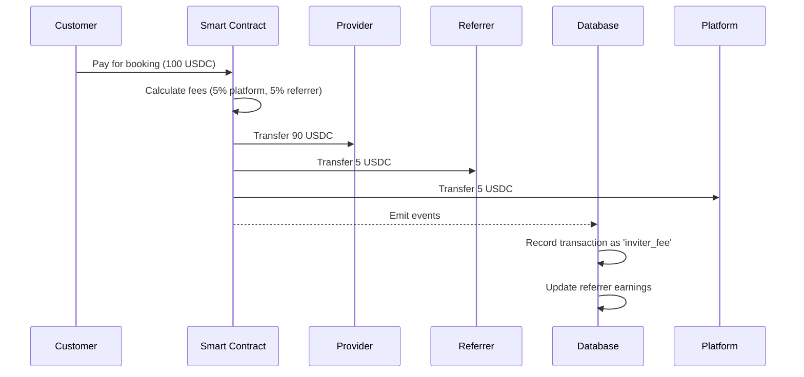

# BookMe Referral System Implementation Documentation

## Executive Summary

The BookMe referral system enables providers to invite other users to become providers and earn a 5% commission from their referred providers' bookings. The smart contract infrastructure already supports referral functionality - this document outlines the complete implementation plan for the database, backend APIs, and frontend interface.

## Table of Contents

1. [System Overview](#system-overview)
2. [Architecture Analysis](#architecture-analysis)
3. [Database Schema](#database-schema)
4. [Backend Implementation](#backend-implementation)
5. [Frontend Implementation](#frontend-implementation)
6. [Payment Flow](#payment-flow)
7. [Security Considerations](#security-considerations)
8. [Implementation Phases](#implementation-phases)

## System Overview

### Key Features
- **Referral Links**: Providers receive unique referral codes/links to share
- **Commission Structure**: 5% commission on all bookings from referred providers
- **Automatic Distribution**: Smart contract handles commission distribution
- **Analytics Dashboard**: Track referrals, earnings, and performance metrics
- **Registration Integration**: Seamless referral code capture during signup

### Current Infrastructure Status

#### ✅ Already Implemented
- Smart contract with full referral support (`inviter` field and fee distribution)
- Backend EIP-712 signer with referral fee calculation
- Blockchain event monitoring for payment distribution
- Transaction table supports `inviter_fee` type

#### ❌ Needs Implementation
- Database schema for referral relationships
- Backend API endpoints for referral management
- Frontend referral dashboard and components
- Registration flow with referral code capture

## Architecture Analysis

### Database Schema Overview
Based on `supabase_database_schema.sql`, the current system uses:
- **users.id**: UUID format (not TEXT)
- **transactions table**: Already supports `inviter_fee` type
- **wallet_address**: Exists in users table with proper validation
- All foreign keys use UUID references

### Smart Contract Integration
The BookingEscrow contract includes:
```solidity
struct Booking {
    address inviter;         // Referrer wallet address
    uint256 inviterFeeRate;  // 5% commission rate
}
```

## Database Schema

### 1. Core Referral Tables

```sql
-- Referral relationships table (simplified - no status needed!)
CREATE TABLE public.referrals (
    id UUID PRIMARY KEY DEFAULT gen_random_uuid(),
    referrer_id UUID NOT NULL REFERENCES public.users(id) ON DELETE CASCADE,
    referee_id UUID NOT NULL REFERENCES public.users(id) ON DELETE CASCADE,
    referral_code TEXT NOT NULL, -- Which code was used for this referral
    created_at TIMESTAMP WITH TIME ZONE DEFAULT now(),

    CONSTRAINT no_self_referral CHECK (referrer_id != referee_id),
    CONSTRAINT unique_referral_relationship UNIQUE (referrer_id, referee_id)
);

-- One referral code per user (simplified - no expiration/limits needed!)
CREATE TABLE public.referral_codes (
    code TEXT PRIMARY KEY,
    user_id UUID NOT NULL UNIQUE REFERENCES public.users(id) ON DELETE CASCADE, -- UNIQUE = one code per user forever
    usage_count INTEGER DEFAULT 0,
    created_at TIMESTAMP WITH TIME ZONE DEFAULT now()
);

-- Update users table with referral fields
ALTER TABLE public.users
ADD COLUMN IF NOT EXISTS referral_earnings NUMERIC DEFAULT 0.00,
ADD COLUMN IF NOT EXISTS referral_count INTEGER DEFAULT 0,
ADD COLUMN IF NOT EXISTS referred_by UUID REFERENCES public.users(id);
```

### 2. Database Indexes

```sql
-- Indexes for referrals table
CREATE INDEX IF NOT EXISTS idx_referrals_referrer_id ON public.referrals(referrer_id);
CREATE INDEX IF NOT EXISTS idx_referrals_referee_id ON public.referrals(referee_id);
CREATE INDEX IF NOT EXISTS idx_referrals_code ON public.referrals(referral_code);

-- Indexes for referral_codes table (user_id already has UNIQUE constraint)
CREATE INDEX IF NOT EXISTS idx_referral_codes_usage_count ON public.referral_codes(usage_count);

-- Index for users table referral tracking
CREATE INDEX IF NOT EXISTS idx_users_referred_by ON public.users(referred_by);
```

### 3. Database Functions

```sql
-- Apply referral code atomically
CREATE OR REPLACE FUNCTION apply_referral_code(
  referee_user_id UUID,
  referrer_user_id UUID,
  referral_code TEXT
) RETURNS VOID AS $$
BEGIN
  UPDATE users SET referred_by = referrer_user_id WHERE id = referee_user_id;

  INSERT INTO referrals (referrer_id, referee_id, referral_code)
  VALUES (referrer_user_id, referee_user_id, referral_code);

  UPDATE referral_codes
  SET usage_count = usage_count + 1
  WHERE code = referral_code;

  UPDATE users
  SET referral_count = referral_count + 1
  WHERE id = referrer_user_id;
END;
$$ LANGUAGE plpgsql;

-- Record referral earnings
CREATE OR REPLACE FUNCTION record_referral_earning(
  referrer_user_id UUID,
  referee_user_id UUID,
  booking_uuid UUID,
  commission_amount NUMERIC
) RETURNS VOID AS $$
BEGIN
  INSERT INTO transactions (
    provider_id,
    type,
    amount,
    booking_id,
    source_user_id,
    description
  ) VALUES (
    referrer_user_id,
    'inviter_fee',
    commission_amount,
    booking_uuid,
    referee_user_id,
    'Referral commission from booking'
  );

  UPDATE users
  SET referral_earnings = referral_earnings + commission_amount
  WHERE id = referrer_user_id;
END;
$$ LANGUAGE plpgsql;
```

### 4. Row Level Security

```sql
ALTER TABLE public.referrals ENABLE ROW LEVEL SECURITY;
ALTER TABLE public.referral_codes ENABLE ROW LEVEL SECURITY;

-- Users can see their own referral data
CREATE POLICY "referrals_own_data" ON public.referrals
  FOR ALL USING (referrer_id = auth.uid() OR referee_id = auth.uid());

CREATE POLICY "referral_codes_own_data" ON public.referral_codes
  FOR ALL USING (user_id = auth.uid());

-- Public read for referral code validation (all codes are active)
CREATE POLICY "referral_codes_public_read" ON public.referral_codes
  FOR SELECT USING (true);
```

## Backend Implementation

### 1. Referral Routes (`backend/src/routes/referrals.js`)

```javascript
import { Hono } from 'hono';
import { verifyPrivyAuth, getSupabaseAdmin } from '../middleware/auth.js';

const supabaseAdmin = getSupabaseAdmin();

export default function referralRoutes(app) {

  /**
   * GET /api/referrals/my-code
   * Get or create user's referral code
   */
  app.get('/api/referrals/my-code', verifyPrivyAuth, async (c) => {
    try {
      const userId = c.get('userId');

      let { data: existingCode } = await supabaseAdmin
        .from('referral_codes')
        .select('*')
        .eq('user_id', userId)
        .single();

      if (!existingCode) {
        const code = generateReferralCode(userId);

        const { data: newCode } = await supabaseAdmin
          .from('referral_codes')
          .insert({
            code,
            user_id: userId
          })
          .select()
          .single();

        existingCode = newCode;
      }

      const { data: stats } = await supabaseAdmin
        .from('referrals')
        .select('id')
        .eq('referrer_id', userId);

      return c.json({
        code: existingCode.code,
        referralUrl: `${process.env.FRONTEND_URL}/register?ref=${existingCode.code}`,
        usageCount: existingCode.usage_count,
        activeReferrals: stats?.length || 0
      });

    } catch (error) {
      console.error('Get referral code error:', error);
      return c.json({ error: 'Failed to get referral code' }, 500);
    }
  });

  /**
   * GET /api/referrals/stats
   * Get referral statistics and earnings
   */
  app.get('/api/referrals/stats', verifyPrivyAuth, async (c) => {
    try {
      const userId = c.get('userId');

      const { data: user } = await supabaseAdmin
        .from('users')
        .select('referral_count, referral_earnings')
        .eq('id', userId)
        .single();

      const { data: recentEarnings } = await supabaseAdmin
        .from('transactions')
        .select('amount, created_at, booking_id')
        .eq('provider_id', userId)
        .eq('type', 'inviter_fee')
        .order('created_at', { ascending: false })
        .limit(10);

      const { data: pendingBookings } = await supabaseAdmin
        .from('bookings')
        .select(`
          total_price,
          customer:users!customer_id(referred_by)
        `)
        .eq('status', 'paid')
        .eq('users.referred_by', userId);

      const pendingEarnings = pendingBookings
        ?.filter(b => b.customer?.referred_by === userId)
        .reduce((sum, b) => sum + (b.total_price * 0.05), 0) || 0;

      return c.json({
        totalReferrals: user?.referral_count || 0,
        totalEarnings: user?.referral_earnings || 0,
        pendingEarnings,
        recentEarnings: recentEarnings || []
      });

    } catch (error) {
      console.error('Get referral stats error:', error);
      return c.json({ error: 'Failed to get referral statistics' }, 500);
    }
  });

  /**
   * POST /api/referrals/register
   * Apply referral code during registration
   */
  app.post('/api/referrals/register', verifyPrivyAuth, async (c) => {
    try {
      const userId = c.get('userId');
      const { referralCode } = await c.req.json();

      if (!referralCode) {
        return c.json({ error: 'Referral code is required' }, 400);
      }

      const { data: codeData } = await supabaseAdmin
        .from('referral_codes')
        .select('user_id, usage_count')
        .eq('code', referralCode)
        .single();

      if (!codeData) {
        return c.json({ error: 'Invalid referral code' }, 400);
      }

      if (codeData.user_id === userId) {
        return c.json({ error: 'Cannot use your own referral code' }, 400);
      }

      const { data: existingUser } = await supabaseAdmin
        .from('users')
        .select('referred_by')
        .eq('id', userId)
        .single();

      if (existingUser?.referred_by) {
        return c.json({ error: 'User already has a referrer' }, 400);
      }

      await supabaseAdmin.rpc('apply_referral_code', {
        referee_user_id: userId,
        referrer_user_id: codeData.user_id,
        referral_code: referralCode
      });

      return c.json({ success: true });

    } catch (error) {
      console.error('Apply referral code error:', error);
      return c.json({ error: 'Failed to apply referral code' }, 500);
    }
  });

  /**
   * GET /api/referrals/validate/:code
   * Validate referral code (public endpoint)
   */
  app.get('/api/referrals/validate/:code', async (c) => {
    try {
      const code = c.req.param('code');

      const { data: codeData } = await supabaseAdmin
        .from('referral_codes')
        .select(`
          code,
          usage_count,
          user:users(display_name)
        `)
        .eq('code', code)
        .single();

      if (!codeData) {
        return c.json({ valid: false, error: 'Code not found' });
      }

      // All codes are valid (simplified logic)
      return c.json({
        valid: true,
        referrerName: codeData.user?.display_name,
        error: null
      });

    } catch (error) {
      console.error('Validate referral code error:', error);
      return c.json({ valid: false, error: 'Validation failed' });
    }
  });

  /**
   * GET /api/referrals/earnings
   * Get detailed earnings history
   */
  app.get('/api/referrals/earnings', verifyPrivyAuth, async (c) => {
    try {
      const userId = c.get('userId');
      const { limit = '20', offset = '0' } = c.req.query();

      const { data: earnings } = await supabaseAdmin
        .from('transactions')
        .select(`
          *,
          booking:bookings(
            id,
            scheduled_at,
            total_price,
            service:services(title)
          ),
          source_user:users!source_user_id(display_name)
        `)
        .eq('provider_id', userId)
        .eq('type', 'inviter_fee')
        .order('created_at', { ascending: false })
        .range(parseInt(offset), parseInt(offset) + parseInt(limit) - 1);

      return c.json(earnings || []);

    } catch (error) {
      console.error('Get earnings history error:', error);
      return c.json({ error: 'Failed to get earnings history' }, 500);
    }
  });
}

// Helper function to generate unique referral codes
function generateReferralCode(userId) {
  const chars = 'ABCDEFGHIJKLMNOPQRSTUVWXYZ0123456789';
  const codeLength = 8;
  let result = '';

  const seed = userId.replace(/-/g, '').substr(-8);

  for (let i = 0; i < codeLength; i++) {
    const index = (parseInt(seed.charAt(i % seed.length), 16) + i) % chars.length;
    result += chars.charAt(index);
  }

  return result;
}
```

### 2. Update Booking Creation (`backend/src/routes/bookings.js`)

Add at line 234:

```javascript
// Check if customer was referred
const { data: customerData } = await supabaseAdmin
  .from('users')
  .select('referred_by')
  .eq('id', userId)
  .single();

const hasInviter = !!customerData?.referred_by;
let inviterAddress = "0x0000000000000000000000000000000000000000";

if (hasInviter) {
  const { data: referrerData } = await supabaseAdmin
    .from('users')
    .select('wallet_address')
    .eq('id', customerData.referred_by)
    .single();

  inviterAddress = referrerData?.wallet_address || inviterAddress;
}

// Update fee calculation
const feeData = eip712Signer.calculateFees(booking.total_price, hasInviter);

// Update EIP-712 authorization with real inviter address
const authResult = await eip712Signer.signBookingAuthorization({
  bookingId: booking.id,
  customer: customerAddress,
  provider: providerAddress,
  inviter: inviterAddress,
  amount: booking.total_price,
  platformFeeRate: feeData.platformFeeRate,
  inviterFeeRate: feeData.inviterFeeRate,
  expiryMinutes: 5,
});
```

### 3. Register Routes in Main App (`backend/src/index.js`)

```javascript
import referralRoutes from "./routes/referrals.js";

// Add after other route registrations
referralRoutes(app);
```

## Frontend Implementation

### 1. Provider Referrals Page (`src/pages/provider/ProviderReferrals.tsx`)

```typescript
import { useState, useEffect } from 'react';
import { PageLayout } from '@/design-system/components/Layout';
import { PageHeader } from '@/design-system/components/PageHeader';
import { Card } from '@/components/ui/card';
import { Button } from '@/components/ui/button';
import { Share2, Copy, Users, TrendingUp, DollarSign, Clock } from 'lucide-react';
import { useToast } from '@/hooks/use-toast';
import { ApiClient } from '@/lib/api-migration';

export default function ProviderReferrals() {
  const [referralData, setReferralData] = useState(null);
  const [stats, setStats] = useState(null);
  const [earnings, setEarnings] = useState([]);
  const [loading, setLoading] = useState(true);
  const { toast } = useToast();

  useEffect(() => {
    loadReferralData();
  }, []);

  const loadReferralData = async () => {
    try {
      const [codeData, statsData, earningsData] = await Promise.all([
        ApiClient.getReferralCode(),
        ApiClient.getReferralStats(),
        ApiClient.getReferralEarnings()
      ]);

      setReferralData(codeData);
      setStats(statsData);
      setEarnings(earningsData);
    } catch (error) {
      toast({
        title: 'Error',
        description: 'Failed to load referral data',
        variant: 'destructive'
      });
    } finally {
      setLoading(false);
    }
  };

  const copyReferralLink = () => {
    if (referralData?.referralUrl) {
      navigator.clipboard.writeText(referralData.referralUrl);
      toast({
        title: 'Copied!',
        description: 'Referral link copied to clipboard'
      });
    }
  };

  const shareReferralLink = async () => {
    if (navigator.share && referralData?.referralUrl) {
      try {
        await navigator.share({
          title: 'Join BookMe as a Provider',
          text: 'Start earning on BookMe with my referral link',
          url: referralData.referralUrl
        });
      } catch (error) {
        // User cancelled or error
      }
    }
  };

  if (loading) return <div>Loading...</div>;

  return (
    <PageLayout>
      <PageHeader
        title="Referral Program"
        subtitle="Invite providers and earn 5% commission from their bookings"
      />

      {/* Referral Link Card */}
      <Card className="p-6 mb-6">
        <h3 className="text-lg font-semibold mb-4">Your Referral Link</h3>

        <div className="bg-gray-50 p-3 rounded-lg mb-4">
          <div className="flex justify-between items-center gap-2">
            <span className="text-sm font-mono truncate flex-1">
              {referralData?.referralUrl}
            </span>
            <Button
              variant="outline"
              size="sm"
              onClick={copyReferralLink}
            >
              <Copy className="h-4 w-4" />
            </Button>
          </div>
        </div>

        <div className="flex gap-2">
          <Button
            onClick={shareReferralLink}
            className="flex-1"
          >
            <Share2 className="h-4 w-4 mr-2" />
            Share Link
          </Button>
        </div>

        <div className="mt-4 pt-4 border-t">
          <p className="text-sm text-gray-600">Referral Code</p>
          <p className="text-2xl font-bold font-mono">{referralData?.code}</p>
        </div>
      </Card>

      {/* Statistics Grid */}
      <div className="grid grid-cols-1 md:grid-cols-4 gap-4 mb-6">
        <Card className="p-4">
          <div className="flex items-start justify-between">
            <div>
              <p className="text-sm text-gray-600">Total Referrals</p>
              <p className="text-2xl font-bold">{stats?.totalReferrals || 0}</p>
            </div>
            <Users className="h-8 w-8 text-gray-400" />
          </div>
        </Card>

        <Card className="p-4">
          <div className="flex items-start justify-between">
            <div>
              <p className="text-sm text-gray-600">Total Earnings</p>
              <p className="text-2xl font-bold">${stats?.totalEarnings || 0}</p>
            </div>
            <DollarSign className="h-8 w-8 text-gray-400" />
          </div>
        </Card>

        <Card className="p-4">
          <div className="flex items-start justify-between">
            <div>
              <p className="text-sm text-gray-600">Pending Earnings</p>
              <p className="text-2xl font-bold">${stats?.pendingEarnings || 0}</p>
            </div>
            <Clock className="h-8 w-8 text-gray-400" />
          </div>
        </Card>

        <Card className="p-4">
          <div className="flex items-start justify-between">
            <div>
              <p className="text-sm text-gray-600">Conversion Rate</p>
              <p className="text-2xl font-bold">
                {stats?.totalReferrals ?
                  Math.round((stats.activeReferrals / stats.totalReferrals) * 100) : 0}%
              </p>
            </div>
            <TrendingUp className="h-8 w-8 text-gray-400" />
          </div>
        </Card>
      </div>

      {/* Earnings History */}
      <Card className="p-6">
        <h3 className="text-lg font-semibold mb-4">Recent Earnings</h3>

        {earnings.length === 0 ? (
          <p className="text-gray-500 text-center py-8">No earnings yet</p>
        ) : (
          <div className="space-y-3">
            {earnings.map((earning) => (
              <div key={earning.id} className="flex justify-between items-center p-3 border rounded-lg">
                <div>
                  <p className="font-medium">
                    {earning.source_user?.display_name}
                  </p>
                  <p className="text-sm text-gray-600">
                    {earning.booking?.service?.title}
                  </p>
                  <p className="text-xs text-gray-500">
                    {new Date(earning.created_at).toLocaleDateString()}
                  </p>
                </div>
                <div className="text-right">
                  <p className="font-bold text-green-600">
                    +${earning.amount}
                  </p>
                  <p className="text-xs text-gray-500">
                    5% of ${earning.booking?.total_price}
                  </p>
                </div>
              </div>
            ))}
          </div>
        )}
      </Card>
    </PageLayout>
  );
}
```

### 2. Navigation Integration (`src/components/NewNavigation.tsx`)

Add to provider navigation items:

```typescript
{
  label: "Referrals",
  icon: Users,
  href: "/provider/referrals",
  isExternal: false,
  showInProviderMode: true
}
```

### 3. Registration Hook (`src/hooks/useReferralCode.ts`)

```typescript
import { useState, useEffect } from 'react';

export function useReferralCode() {
  const [referralCode, setReferralCode] = useState<string | null>(null);
  const [isValidating, setIsValidating] = useState(false);
  const [isValid, setIsValid] = useState<boolean | null>(null);
  const [referrerName, setReferrerName] = useState<string | null>(null);

  useEffect(() => {
    const urlParams = new URLSearchParams(window.location.search);
    const code = urlParams.get('ref');
    if (code) {
      setReferralCode(code);
      validateCode(code);
    }
  }, []);

  const validateCode = async (code: string) => {
    setIsValidating(true);
    try {
      const response = await fetch(`/api/referrals/validate/${code}`);
      const result = await response.json();
      setIsValid(result.valid);
      setReferrerName(result.referrerName);
    } catch (error) {
      setIsValid(false);
    } finally {
      setIsValidating(false);
    }
  };

  const applyReferralCode = async () => {
    if (!referralCode || !isValid) return false;

    try {
      const token = await getPrivyToken();
      const response = await fetch('/api/referrals/register', {
        method: 'POST',
        headers: {
          'Content-Type': 'application/json',
          'Authorization': `Bearer ${token}`
        },
        body: JSON.stringify({ referralCode })
      });

      return response.ok;
    } catch (error) {
      console.error('Failed to apply referral code:', error);
      return false;
    }
  };

  return {
    referralCode,
    isValid,
    isValidating,
    referrerName,
    applyReferralCode
  };
}
```

### 4. API Client Updates (`src/lib/api-migration.ts`)

Add referral methods:

```typescript
export class ApiClient {
  // ... existing methods ...

  static async getReferralCode() {
    await this.waitForInitialization();
    return this.backendApi!.getReferralCode();
  }

  static async getReferralStats() {
    await this.waitForInitialization();
    return this.backendApi!.getReferralStats();
  }

  static async getReferralEarnings(limit = 20, offset = 0) {
    await this.waitForInitialization();
    return this.backendApi!.getReferralEarnings(limit, offset);
  }

  static async applyReferralCode(referralCode: string) {
    await this.waitForInitialization();
    return this.backendApi!.applyReferralCode(referralCode);
  }

  static async validateReferralCode(code: string) {
    // This is a public endpoint, no auth needed
    const response = await fetch(`${this.backendUrl}/api/referrals/validate/${code}`);
    if (!response.ok) throw new Error('Failed to validate referral code');
    return response.json();
  }
}
```

### 5. Route Configuration (`src/App.tsx`)

Add referral route:

```typescript
<Route
  path="/provider/referrals"
  element={
    <ProtectedRoute>
      <ProviderReferrals />
    </ProtectedRoute>
  }
/>
```

## Payment Flow

### Commission Distribution Flow



## Security Considerations

### Prevention Mechanisms
1. **No Self-Referrals**: Database constraint prevents users from referring themselves
2. **Unique Relationships**: Each user can only be referred once
3. **Code Validation**: Permanent referral codes with usage tracking
4. **Wallet Verification**: Only verified wallet addresses receive commissions

### Data Protection
1. **Row-Level Security**: Users can only access their own referral data
2. **API Authentication**: All referral management endpoints require authentication
3. **Rate Limiting**: Prevent abuse of code generation and validation endpoints
4. **Secure Code Generation**: Use UUID-based seeding for consistent but unpredictable codes

## Implementation Phases

### Phase 1: Database & Backend (Week 1)
- [ ] Create referral database schema
- [ ] Implement database functions and triggers
- [ ] Create backend API routes
- [ ] Update booking creation flow
- [ ] Test referral commission calculations

### Phase 2: Frontend Integration (Week 2)
- [ ] Build referral dashboard page
- [ ] Add navigation menu items
- [ ] Implement referral link sharing
- [ ] Update registration flow with code capture
- [ ] Create referral code validation UI

### Phase 3: Testing & Optimization (Week 3)
- [ ] End-to-end testing of referral flow
- [ ] Performance optimization
- [ ] Add analytics and metrics
- [ ] Create admin monitoring tools
- [ ] Documentation and user guides

### Phase 4: Launch & Monitor (Week 4)
- [ ] Soft launch with selected providers
- [ ] Monitor commission distributions
- [ ] Gather user feedback
- [ ] Optimize based on usage patterns
- [ ] Full rollout

## Analytics Queries

### Performance Metrics

```sql
-- Top performing referrers
SELECT
  u.display_name,
  u.referral_count,
  u.referral_earnings,
  COUNT(DISTINCT b.id) as completed_bookings,
  AVG(t.amount) as avg_commission
FROM users u
LEFT JOIN transactions t ON u.id = t.provider_id AND t.type = 'inviter_fee'
LEFT JOIN bookings b ON t.booking_id = b.id
WHERE u.referral_count > 0
GROUP BY u.id, u.display_name, u.referral_count, u.referral_earnings
ORDER BY u.referral_earnings DESC
LIMIT 10;

-- Monthly referral growth
SELECT
  DATE_TRUNC('month', r.created_at) as month,
  COUNT(*) as new_referrals,
  COUNT(DISTINCT r.referrer_id) as active_referrers,
  COUNT(*) as total_referrals
FROM referrals r
GROUP BY DATE_TRUNC('month', r.created_at)
ORDER BY month DESC;

-- Referral conversion funnel
WITH funnel AS (
  SELECT
    rc.code,
    rc.usage_count as clicks,
    COUNT(DISTINCT r.id) as signups,
    COUNT(DISTINCT b.id) as bookings_made
  FROM referral_codes rc
  LEFT JOIN referrals r ON rc.code = r.referral_code
  LEFT JOIN bookings b ON r.referee_id = b.provider_id AND b.status = 'completed'
  GROUP BY rc.code, rc.usage_count
)
SELECT
  COUNT(*) as total_codes,
  AVG(clicks) as avg_clicks,
  AVG(CASE WHEN clicks > 0 THEN signups::float / clicks ELSE 0 END) as signup_rate,
  AVG(CASE WHEN signups > 0 THEN bookings_made::float / signups ELSE 0 END) as booking_rate
FROM funnel;
```


## Conclusion

This comprehensive referral system implementation leverages BookMe's existing blockchain infrastructure while adding the necessary database schema, backend APIs, and frontend components to create a complete referral program. The system is designed to be secure, scalable, and provide immediate value to providers through automatic commission distribution via smart contracts.